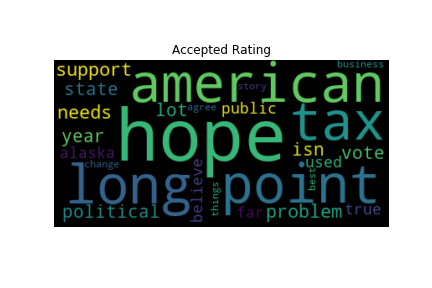
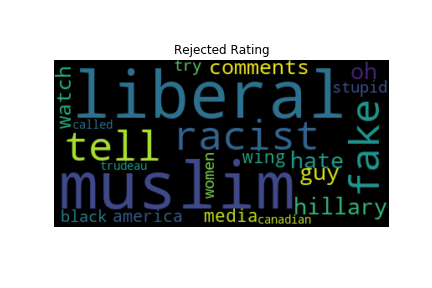
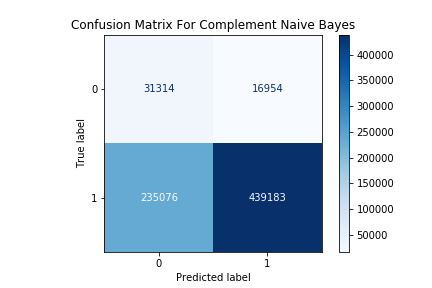

# Identifying Rejected Comment Language

Motivation:
Online comments involving bullying or inappropriate language has been show to have some unintended consequences. Automating the process to identify underlying bullying, especially when discussing politics can not only save humans from having to perform the same task, but can aide platforms in adhering more closely to their goals. My overall goal is to predict comments that are bullying or inappropriate in nature and reject those comments. 

## Data/EDA:
The comments on news articles in my data-set certainly highlight the difficulty of remaining civil during civil discourse. At first glance, the comments that provide “likes”, or “disagree” like votes would be a form of data leakage and will not be utilized in the prediction of weather or not a comment should be rejected since rejected comments will likely have few to no votes. 

Visualizing the length of the text as well has shown that there is not a strong correlation between normal text distributions and rating but may provide useful in model training. 

Of the data I viewed, 97% if the comments were approved while the remaining percent were rejected. This class imbalance of my target value will prove to be a bit of a challenge, already, predicting that all comments should be approved would make you right 97% of the time. 

## Utilizing Text data through Text Vectorization:

To determine the impact of specific language on approval status, words must be converted into values. These values can then be utilized in a variety of machine learning algorithms to determine their weights on the status of the comment. One way to convert these terms is utilizing the concept of Term Frequency and Inverse Document Frequency to calculate how important a word is in a comment and compare that to the remaining comments in the overall corpus. 

The word clouds below highlight the top 100 terms utilized in approval and rejected status when vectorized:

 

We can see that humans can start to understand the terms and their possible use in inappropriate comments but the question is if a computer could also identify these concepts.

## Modeling

Beginning the modeling process, I started off with what I would consider a fairly good predictor , Random Forest Classifier. What I found at first is that my Accuracy and Recall scores were fairly low while precision stayed fairly high. Worrying most about accuracy, I found that my issue with imbalanced classes would make the most difference. The graph below signifies the improvements based on the improving the Random Forest Classifier. 

The Final models I trained were:

Random Forest, Gradient Boosting, Binomial Naive Bays and Complement Naive Bayes. Getting a visual of the Matrices below we see that each model does fairly well at identifying Approved Comments and identifying Rejected Comments is a difficult task. X model does the best.

## Another view at the Text

### FP TEXT

A quick view at text that were predicted to be approved but a human had rejected shows some concept subtleties that would require a more direct model highlighting context. 

Example 1:

**Scumbag lawyers representing scumbag lazy bums.  The world would be a better place without all of them.** 

Example 2:

**Two trump supporters were standing on a beach in Florida. One says to the other one, "What do you think is closer, New York City or the Moon?" The other one replies, "Duh, you can see the Moon from here." 
These two examples show an obvious rude or bully like nature to the texts. Training a model that would pick up in this subtlety would require a different data set and have a model focused solely on context in longer phrases rather than terms.**

### FN TEXT

Taking a look at a few examples of text that was predicted to be rejected for which a human approved also highlights some issues with focusing the vectorization on TFIDF. 

Example 1:

**Wouldn't it be a better face-to-face conversation if the "persons of all races" first acknowledge that race is a social construction--an ideology which assumes that simple external differences are linked to other, more complex internal differences?** 

Example 2:

**I remember. My mother was one of those. She'd be disgusted with her party today. 
These examples show some bias in my best model highlighting the focus on negative words like “disgusted” when the context is not inappropriate, simply opinionated. Example one also notes that discussing race may possibly play a larger role in rejected comments and may have led this one to also predict rejection.**

## SUMMARY

Overall, my final model's true predictions do show a blatant difference between terms with negative connotations that relate to many rejected comments. My model's inability to understand context requires more research, more data and improved text featurization!

## Future Directions:

